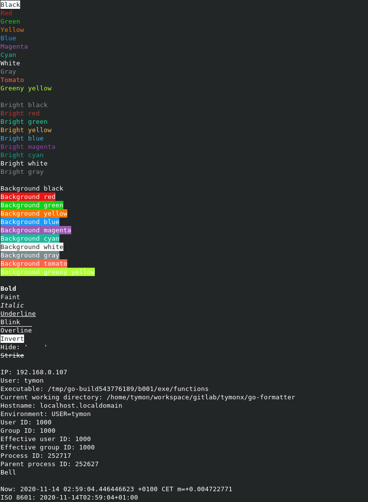

# Go Formatter

The Go Formatter library implements **replacement fields** surrounded by curly braces `{}` format strings.

[[_TOC_]]

## Features

*   Format string by providing arguments without using placeholders or format verbs `%`
*   Format string using automatic placeholder `{p}`
*   Format string using positional placeholders `{pN}`
*   Format string using named placeholders `{name}`
*   Format string using object placeholders `{.Field}`, `{p.Field}` and `{pN.Field}` where `Field` is an exported `struct` field or method
*   Use custom placeholder string. Default is `p`
*   Use custom replacement delimiters. Default are `{` and `}`
*   Use custom replacement functions with transformation using pipeline `|`
*   Many different handy built-in functions `{name}`
*   Support for text colorization using `{color}`, `{rgb}`, `{bright}`, `{background}` and so on
*   Support for setting text attributes like **bold**, _italic_, ~~strike~~, blink and so on
*   Support for getting OS values like `{ip}`, `{user}`, `{hostname}`, `{cwd}`, `{pid}`, `{env}` and so on
*   Support for getting and formatting time using `{now}`, `{rfc3339}`, `{iso8601}` and so on
*   Support for string transformation using `{lower}`, `{upper}`, `{capitalize}` and so on
*   Support for path transformation using `{absolute}`, `{base}`, `{directory}`, `{clean}`, `{extension}` and so on
*   Support for object formatting using `{fields}`, `{json}`, `{indent}` and so on
*   Auto ANSI escape sequences detection and forcing it using the `FORCE_ESCAPE_SEQUENCES` environment variable
*   Under the hood it uses the standard [text/template](https://golang.org/pkg/text/template/) package

## Usage

Import `formatter` package:

```go
import "gitlab.com/tymonx/go-formatter/formatter"
```

### Without arguments

```go
formatted, err := formatter.Format("Without arguments")

fmt.Println(formatted)
```

Output:

```plaintext
Without arguments
```

### With arguments

```go
formatted, err := formatter.Format("With arguments", 3, nil, 4.5, true, "arg1", []byte{}, Error("error"))

fmt.Println(formatted)
```

Output:

```plaintext
With arguments 3 <nil> 4.5 true arg1 [] error
```

### Automatic placeholder

```go
formatted, err := formatter.Format("Automatic placeholder {p}:{p}:{p}():", "dir/file", 1, "func1")

fmt.Println(formatted)
```

Output:

```plaintext
Automatic placeholder dir/file:1:func1():
```

### Positional placeholders

```go
formatted, err := formatter.Format("Positional placeholders {p1}:{p0}:{p2}():", 2, "dir/file", "func1")

fmt.Println(formatted)
```

Output:

```plaintext
Positional placeholders dir/file:2:func1():
```

### Named placeholders

```go
formatted, err := formatter.Format("Named placeholders {file}:{line}:{function}():", formatter.Named{
	"line":     3,
	"function": "func1",
	"file":     "dir/file",
})

fmt.Println(formatted)
```

Output:

```plaintext
Named placeholders dir/file:3:func1():
```

### Object placeholders

It handles exported `struct` fields and methods. First letter must be capitalized.
Transformation using pipeline `|` also works with exported `struct` fields and `struct` methods.
For more information about **pipelines** please see the [Pipelines](https://golang.org/pkg/text/template/#hdr-Pipelines)
section from the standard [text/template](https://golang.org/pkg/text/template) package.

```go
object := struct {
	Line     int
	Function string
	File     string
}{
	Line:     4,
	Function: "func1",
	File:     "dir/file",
}

formatted, err := formatter.Format("Object placeholders {.File}:{.Line}:{.Function}():", object)

fmt.Println(formatted)
```

Output:

```plaintext
Object placeholders dir/file:4:func1():
```

### Object with automatic placeholder

It handles exported `struct` fields and methods. First letter must be capitalized.
Transformation using pipeline `|` also works with exported `struct` fields and `struct` methods.
For more information about **pipelines** please see the [Pipelines](https://golang.org/pkg/text/template/#hdr-Pipelines)
section from the standard [text/template](https://golang.org/pkg/text/template) package.

```go
object1 := struct {
	Message string
}{
	Message: "object1",
}

object2 := struct {
	X int
}{
	X: 2,
}

formatted, err := formatter.Format("Object with automatic placeholder {p.Message} {p.X}", object1, object2)

fmt.Println(formatted)
```

Output:

```plaintext
Object with automatic placeholder object1 2
```

### Object with positional placeholders

It handles exported `struct` fields and methods. First letter must be capitalized.
Transformation using pipeline `|` also works with exported `struct` fields and `struct` methods.
For more information about **pipelines** please see the [Pipelines](https://golang.org/pkg/text/template/#hdr-Pipelines)
section from the standard [text/template](https://golang.org/pkg/text/template) package.

```go
object1 := struct {
	Message string
}{
	Message: "object1",
}

object2 := struct {
	X int
}{
	X: 2,
}

formatted, err := formatter.Format("Object with positional placeholders {p1.X} {p0.Message}", object1, object2)

fmt.Println(formatted)
```

Output:

```plaintext
Object with positional placeholders 2 object1
```

### Mixed placeholders

```go
objectPointer := &struct {
	X int
	Y int
	Z int
}{
	X: 2,
	Z: 6,
	Y: 3,
}

formatted, err := formatter.Format("Mixed placeholders {.X}.{p}.{.Y}.{.Z} {p1} {p0}", objectPointer, "b", "c", nil)

fmt.Println(formatted)
```

Output:

```plaintext
Mixed placeholders 2.{2 3 6}.3.6 b {2 3 6} c <nil>
```

### Writer

```go
var buffer bytes.Buffer

err := formatter.FormatWriter(&buffer, "Writer {p2}", 3, "foo", "bar")

fmt.Println(buffer.String())
```

Output:

```plaintext
Writer bar 3 foo
```

### Functions

Transformation using pipeline `|` also works with exported `struct` fields and `struct` methods.
For more information about **pipelines** please see the [Pipelines](https://golang.org/pkg/text/template/#hdr-Pipelines)
section from the standard [text/template](https://golang.org/pkg/text/template) package.

```go
functions := formatter.Functions{
	"str": func() string {
		return "text"
	},
	"number": func() int {
		return 3
	},
	"boolean": func() bool {
		return true
	},
	"floating": func() float64 {
		return 4.5
	},
	"transform": func(value int) int {
		return value + 3
	},
}

formatted, err := formatter.New().SetFunctions(functions).Format("Custom functions {str} {p} {number} {boolean} {floating} {number | transform}", 5)

fmt.Println(formatted)
```

Output:

```plaintext
Custom functions text 5 3 true 4.5 6
```

### Custom placeholder

```go
formatted, err := formatter.New().SetPlaceholder("arg").Format("Custom placeholder {arg1} {arg0}", "2", 3)

fmt.Println(formatted)
```

Output:

```plaintext
Custom placeholder 3 2
```

### Custom delimiters

```go
formatted, err := formatter.New().SetDelimiters("<", ">").Format("Custom delimiters <p1> <p0>", "4", 3)

fmt.Println(formatted)
```

Output:

```plaintext
Custom delimiters 3 4
```

### Must format

```go
fmt.Println(formatter.MustFormat("With arguments", 3, nil, false, 4.5, "text", []byte{}, Error("error")))
```

Output:

```plaintext
With arguments 3 <nil> false 4.5 text [] error
```

### Colors

Standard:

```go
formatted, err := formatter.Format("With colors {red}red{normal} {green}green{normal} {blue}blue{normal}")

fmt.Println(formatted)
```

Bright:

```go
formatted, err := formatter.Format("With bright colors {magenta | bright}magenta{normal}")

fmt.Println(formatted)
```

Background:

```go
formatted, err := formatter.Format("With background colors {yellow | background}yellow{normal}")

fmt.Println(formatted)
```

Background + bright:

```go
formatted, err := formatter.Format("With background bright colors {cyan | bright | background}cyan{normal}")

fmt.Println(formatted)
```

RGB:

```go
formatted, err := formatter.Format("With RGB {rgb 255 165 0}funky{normal}")

fmt.Println(formatted)
```

Background RGB:

```go
formatted, err := formatter.Format("With background RGB {rgb 255 165 0 | background}funky{normal}")

fmt.Println(formatted)
```

### Built-in functions

For more details please see the `formatter` package
[documentation](https://tymonx.gitlab.io/go-formatter/doc/pkg/gitlab.com/tymonx/go-formatter/formatter/).

Run example:

```plaintext
go run ./examples/functions/
```

Output:



### Overriding ANSI escape sequences detection

By default, the `formatter` package determines whether or not to use
[ANSI escape sequences](https://en.wikipedia.org/wiki/ANSI_escape_code) based
on whether it's connected to a **TTY** or not. This works for most use cases,
but may not behave as expected if you use the `formatter` package in a pipeline
of commands, where **STDOUT** is being piped to another command.

To force it, add `FORCE_ESCAPE_SEQUENCES=1` to the environment
you're running in. For example:

```plaintext
FORCE_ESCAPE_SEQUENCES=1 ./app | tee output.log
```

Supported values for the `FORCE_ESCAPE_SEQUENCES` environment variable:

*   To force enable: `1`, `true`, `enable`, `on`, `yes`, `y`
*   To force disable: `0`, `false`, `disable`, `off`, `no`, `n`
*   Auto detection when variable is unset, empty or contains other values
